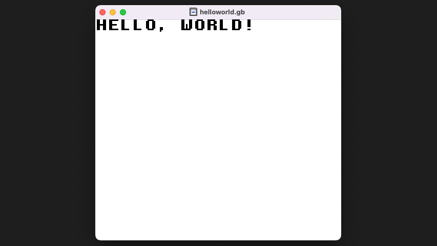

GBDK 是开源工具，我们可以在 GitHub 上直接下载最新的 Release 版本。

我最近习惯使用 MacOS，这里我首先介绍如何在 MacOS 上搭建 GBDK 环境，并成功编译 Hello world 程序。Linux 和 MacOS 是一样的步骤。Windows 也是类似的步骤，如果有问题，欢迎随时在评论区留言。

<!-- more -->

## 下载 GBDK

撰写本文时，GBDK 的稳定版本为 v4.1.1，[点击直接下载](https://github.com/gbdk-2020/gbdk-2020/releases/download/4.1.1/gbdk-macos.tar.gz)。

你也可以访问[这里](https://github.com/gbdk-2020/gbdk-2020/releases)下载最新的版本。

## 文件结构介绍

解压下载得到的压缩包后，我们得到一个名为 `gbdk` 的文件夹，其中的文件结构如下：

- <FontIcon icon="folder" /> bin/ (包含所有预编译好的可执行程序)
- <FontIcon icon="folder" /> include/ (包含相关头文件)
- <FontIcon icon="folder" /> lib/ (包含相关库文件)
- <FontIcon icon="folder" /> examples/ (包含提供的样例)
- <FontIcon icon="folder" /> licenses/ (包含所有许可证)
- <FontIcon icon="pdf" /> gbdk_manual.pdf (gbdk手册)
- <FontIcon icon="pdf" /> sdccman.pdf (sdcc手册)
- <FontIcon icon="changelog" /> ChangeLog (更新日志)
- <FontIcon icon="readme" /> README (自述文件)

接下来我们需要把 `gbdk` 文件夹移动到一个合适的位置，并添加环境变量。

## 移动 gbdk 文件夹，并添加相关的环境变量

可以把该文件夹拷贝到 `/opt/gbdk`：

```bash
sudo cp -r gbdk /opt/gbdk
```

然后设置相关的环境变量。

::: tip
为了永久生效，可以编辑 /etc/profile 或者你所使用的 shell 配置文件：
:::

::: tabs

@tab /etc/profile

```bash
echo "export GBDKDIR=/opt/gbdk/" | sudo tee -a /etc/profile
```

@tab ~/.bashrc

```bash
echo "export GBDKDIR=/opt/gbdk/" | sudo tee -a ~/.bashrc
```

@tab ~/.zshrc

```bash
echo "export GBDKDIR=/opt/gbdk/" | sudo tee -a ~/.zshrc
```

:::

::: info
GBDKDIR 系统环境变量是必须设置的内容，除此之外，你可以选择将 bin 目录设置到 PATH 变量中，这样我们可以更方便的使用一些预编译的可执行程序。
:::

## 准备好模拟器 - SameBoy

由于我使用 MacOS，我考虑使用开源、跨平台的模拟器：[SameBoy](https://github.com/LIJI32/SameBoy)，它功能丰富，支持调试，方便我们开发。

打开它的下载页面，下载对应的版本即可：https://sameboy.github.io/downloads/

这里我下载 [MacOS 最新 v0.15.8 版](https://github.com/LIJI32/SameBoy/releases/download/v0.15.8/sameboy_cocoa_v0.15.8.zip)。

解压后是一个 app，拖到 `应用程序` (英文系统中是 `Applications`) 中即可完成安装。

## Hello, world!

接下来编写我们第一个程序：在 GameBoy 的屏幕里打印一行 "Hello,world!"

### 编写源码

`helloworld.c`:

```c
#include <gb/gb.h>
#include <stdio.h>

void main()
{
  printf("HELLO, WORLD!");
}
```

### 命令行编译

在 `helloworld.c` 的同级目录打开命令行，并执行：

```bash
$GBDKDIR/bin/lcc -Wa-l -Wl-m -Wl-j -o helloworld.gb helloworld.c
```

执行结束后，会发现目录下编译得到了 `helloworld.gb`，也就是我们熟悉的 ROM 文件啦，放到模拟器可以直接运行。

### 用 SameBoy 打开，看看效果吧



::: tip
可以将 SameBoy 也加入 PATH，方法后面补充。
:::

恭喜，到这里，你已经入门了！🎉🎉🎉