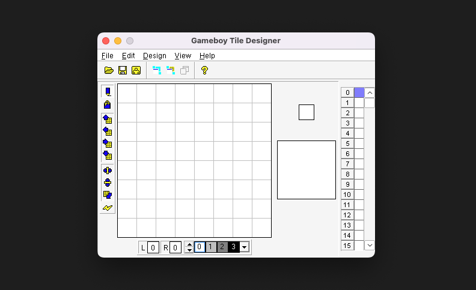

GameBoy 屏幕分辨率为 160*144，对于现在而言，这是非常低的，但是这个分辨率对于那个像素时代而言，却已经足以显示一个个生动活泼的角色了。

[精灵 (Sprite)](https://en.wikipedia.org/wiki/Sprite_(computer_graphics))，在计算机图形学中指 2D 的位图，并经常使用于 2D 游戏中。

举个例子，超级马里奥中，马里奥对应的位图就是精灵。

我们如何使用 GBDK 将一个精灵绘制到 GameBoy 的屏幕中呢？

<!-- more -->

答案是，使用工具，设计好我们的精灵，最后将精灵数据导出为 C 数组。

这里，我们使用最为流行的 GBTD。

::: info 如果你想造轮子
当然，自己写一个工具也是可以的，只要自己写的工具最后导出的 C 数组符合 GBDK 需要的 C 数组格式就行。
:::

## GBTD 简介

在 GameBoy 的世界中，地图多半是由瓦块所组成的瓦块地图 (Tile Map)，精灵实际上也是由一些小小的瓦块组成的。

GBTD, GameBoy Tile Designer，主要用于设计瓦块 (Tile)，并最终导出兼容 GBDK 的 C 数组。

它的界面是这样的：



::: tip 关于 MacOS/Linux 运行 GBTD 和 GBMB 等 Windows 软件
我们上一篇已经下载好了 GBTD 和 GBMB，解压以后就能看到 exe 文件。同时我们也准备好了 Wine 的环境。

这里，我们可以使用 wine 命令运行 exe，以 GBTD 为例：

```bash
wine gbtd.exe
```

这样就可以在 MacOS/Linux 上运行 GBTD 和 GBMB 了。
:::

## GBTD 主要功能说明

## 绘制第一个简单的精灵

接下来，我们绘制一个 `8*8` 的笑脸，并显示在靠近屏幕中央的位置。

::: info 为什么是 8*8
GameBoy 中，精灵的渲染有两种模式（二选一）：

- `8*8`
- `8*16`

每个瓦块的尺寸最小为 `8*8`，所以最简单的精灵的尺寸是 `8*8`，一个瓦块就够。复杂一点的精灵，可能会使用 `8*16` 模式，使用两个瓦块。更复杂一点的精灵，甚至可能是多个 `8*8` 的瓦片组合而成的。
:::