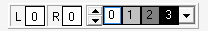
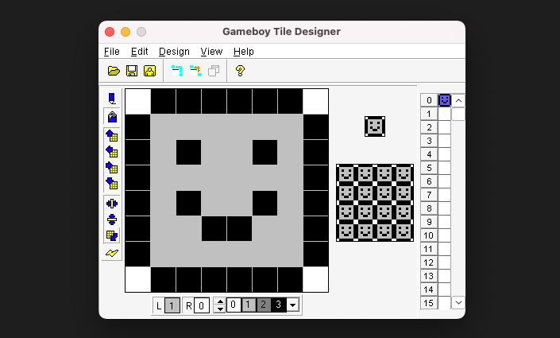
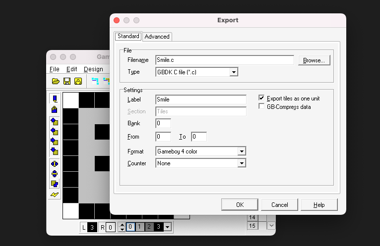

GameBoy 屏幕分辨率为 160*144，对于现在而言，这是非常低的，但是这个分辨率对于那个像素时代而言，却已经足以显示一个个生动活泼的角色了。

[精灵 (Sprite)](https://en.wikipedia.org/wiki/Sprite_(computer_graphics))，在计算机图形学中指 2D 的位图，并经常使用于 2D 游戏中。

举个例子，超级马里奥中，马里奥对应的位图就是精灵。

我们如何使用 GBDK 将一个精灵绘制到 GameBoy 的屏幕中呢？

<!-- more -->

答案是，使用工具，设计好我们的精灵，最后将精灵数据导出为 C 数组。

这里，我们使用最为流行的 GBTD。

::: info 如果你想造轮子
当然，自己写一个工具也是可以的，只要自己写的工具最后导出的 C 数组符合 GBDK 需要的 C 数组格式就行。
:::

## GBTD 简介

在 GameBoy 的世界中，地图多半是由瓦块所组成的瓦块地图 (Tile Map)，精灵实际上也是由一些小小的瓦块组成的。

GBTD, GameBoy Tile Designer，主要用于设计瓦块 (Tile)，并最终导出兼容 GBDK 的 C 数组。

它的界面是这样的：


::: tip 关于 MacOS/Linux 运行 GBTD 和 GBMB
如果没有搭建好环境，请参考上一篇文章，先搭建好环境。

环境搭建好后，且跟着教程一起配置了 alias 后，可以直接使用别名打开：

```bash
# 打开 GBTD
gbtd

# 打开 GBMB
gbmb
```

:::

## 绘制第一个简单的精灵

接下来，我们绘制一个 `8*8` 的笑脸，并显示在靠近屏幕中央的位置。

::: info 为什么是 8*8
GameBoy 中，精灵的渲染有两种模式（二选一）：

- `8*8`
- `8*16`

每个瓦块的尺寸最小为 `8*8`，所以最简单的精灵都是用一个瓦块，这里我们希望精灵不要过于迷你，所以还是选择 `8*8` 的尺寸，实际上，`1*1` 都是可以的，只是依旧还是需要一个 `8*8` 的瓦块来表达。复杂一点的精灵，可能会使用 `8*16` 模式。更复杂一点的精灵，甚至可能是多个 `8*8` 的瓦片组合而成的。
:::

GBTD 的最下方有一个颜色选择器。

左侧 L R 显示的是鼠标左键和鼠标右键对应要在画布上绘制的颜色索引。

右侧的四个色块代表 0 到 3 四个索引色，每个索引对应的颜色是我们自己通过调色板进行配置的，默认调色板是从白到黑的渐变的四个颜色。



GBTD 的左侧工具栏，默认选择了画笔工具，画笔底下是油漆桶工具。往下四个是移动工具，可以自行试试效果。再往下是垂直翻转、水平翻转、旋转以及自动更新。


::: info GBTD 不存在橡皮擦工具
GBTD 不存在橡皮擦工具，这是因为 GameBoy 的颜色模式是索引色模式，而非 RGBA 模式。

如果需要擦除某个画错的部分，你要做的就是使用另一个索引色来填充画错的部分。
:::

当我们在颜色选择器的右侧色块区域使用鼠标左键点击其中一个色块，则鼠标左键即将绘制的颜色索引会变成你点击的那个色块的索引值，简而言之就是接下来你的鼠标左键在画布上绘制的时候画笔（或油漆桶）的颜色变成了你所选色块的颜色。鼠标右键也是一样的逻辑。这样方便我们鼠标左右两个键在画布上绘制图形。

我们首先选择画笔工具，使用鼠标左键点击颜色选择器右侧的索引值为 3 的黑色色块，然后在画布上绘制一个笑脸，当然，你也可以按照自己的想法绘制，只要是 `8*8` 及以内的就行。

然后选择油漆桶工具，选择索引值为 1 的浅灰色色块，然后填充笑脸。

画好后大致长这样（没认真画，教程嘛，意思意思）：



绘制好了，我们就可以开始导出成 GBDK 兼容的 C 数组了。

当然，为了备份，你应该先保存一下。保存后，你将得到一个以 `.gbr` 后缀的文件，下次再用 GBTD 打开它就能继续编辑。

## 导出绘制的精灵

最上面主菜单点击 `Files/ExportTo`，然后配置如下：



::: info 关键参数介绍
Filename - 导出文件的名称，这里我们填入 `Smile.c`

Type - 导出数据的类型，这里我们选择 `GBDK C file`，代表导出文件中包含的数据是兼容 GBDK 的 C 数组

Label - 导出 C 数组的名称，我们在代码中会用到，这里我们命名为 `Smile`

Format - 颜色格式，这里我们选择 `Gameboy 4 color`
:::

点击 `OK` 即可导出。导出成功后，会在 `.gbr` 所在同级目录下得到 `Smile.h` 和 `Smile.c` 文件。

`.h` 文件中是数组相关的声明，而 `.c` 文件中是具体定义，存放了实际的精灵数据。

下面，我们就可以利用 C 数组，开始编写程序，绘制精灵了。

## 编写主程序

```c
#include <gb/gb.h>
#include <stdio.h>
#include "Smile.h"

void main()
{
    set_sprite_data(0, 0, Smile);
    set_sprite_tile(0, 0);

    SHOW_SPRITES;

    move_sprite(0, 72, 68);
}
```